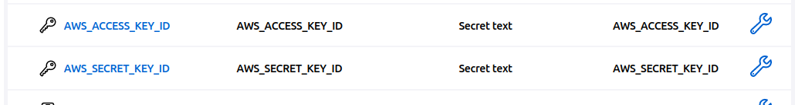

## <font size=”20”> **RDS_REDIS_Nodejs_app** </font>
## <font size=”20”> **Provision AWS Infrastructure using Terraform** </font>

- vpc
- INTERNET-GATEWAY
- 2 public subnet
- 2 private subnet
- NAT-GATEWAY
- Private EC2 (Application)
- Public EC2 (Bastion-host)
- RDS (in the private subnets)
- Elasticache (in the private subnets)
- ALB


## <font size=”20”> **Jenkins Pipeline for Apply Terrraform** </font>

```
$ cd Jenkins-TF
```
```
$ docker build -t jenkins:v1
```
```
$ docker run -d -p 8080:8080 -p 50000:50000 -v /var/run/docker.sock:/var/run/docker
```

## <front size="20"> **Jenkins Master** </front>

BROWSER
```
http://localhost:8080
```
## <front size="20"> **configuring AWS on Jenkins** </front>
JENKINS
Adding aws credentials in secret text 
    Dashboard > Manage Jenkins > Credentials > system > Global credentials (unrestricted) + Add Credentials
    


